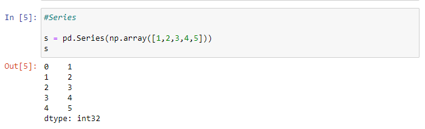

# Pandas 🐼🐼🐼

# Aqui traremos uma pequena introdução da Biblioteca Pandans em Python

### Para iniciar nosso tutorial faça o download abaixo:
- ### [Anaconda](https://www.anaconda.com/products/individual) é uma distribuição das linguagens de programação Python e R para computação científica, que visa simplificar o gerenciamento e implantação de pacotes. A distribuição inclui pacotes de ciência de dados adequados para Windows, Linux e macOS.

- ### Após a instalação, executar o Jupyter Notebook


- ### Com Jupyter Notebook aberto você verá a seguinte tela:


- ### Clique em New -> Python 3


- ### Renomeie seu projeto para Pandas


## Jupyter notebook
 >  O Jupyter Notebook é um interfarce gráfica que permite a edição de notebooks em um navegador web, tais como Google Chrome ou Firefox. O nome Jupyter é um acrônimo criado a partir das linguagens de programação que inicialmente foram aceitas pelo Projeto Jupyter: Julia, Python e R. Além dessas, hoje, o Projeto Jupyter suporta também C++, Ruby, Fortran e outras.

 

 # Para iniciar importaremos as bibliotecas numpy e pandas

 > Numpy: O NumPy é uma poderosa biblioteca Python que é usada principalmente para realizar cálculos em Arrays Multidimensionais. O NumPy fornece um grande conjunto de funções e operações de biblioteca que ajudam os programadores a executar facilmente cálculos numéricos.

 > Pandas: A biblioteca Pandas é uma biblioteca Python para análise de dados. Seu nome é derivado do termo “dados de painel” (panel data), um termo econométrico utilizado para se referir a conjuntos de dados estruturados multidimensionais. Ela possui código aberto e uso gratuito (sob uma licença BSD).


 ### Com a biblioteca importada podemos apresentar um pequeno array unidimensional sem index ou com index




### Para fazer alguns testes utilizaremos o Dataset sobre [Covid](https://brasil.io/dataset/covid19/caso/) 
* É só fazer o download do .csv e referênciar a pasta que o arquivo se encontra, como no exemplo abaixo. 


### Com os comandos ``` df.head()``` e ``` df.tail()``` conseguimos selecionar os primeiros e últimos elementos


### Com o comando ``` df.columns``` Lista-se todas colunas envolvidas


-----

# Filtros

### Filtro com estado igual a SC


### Filtro com estado igual a SC e cidade Joinville


### Filtrando por estado SC utilizando a variável, no caso ``` df[~filtro]``` o símbolo ~ é utilizado como negação, ou seja, todos que não são SC


### Filtrando com lock, os primeiros parâmetros são as linhas e o segunda as colunas


### Filtrando com Ilock, utiliza o index, ou seja, filtra pela posição:


------

### Se pegarmos os exemplos anteriores, podemos ver que os index estão bem extensos, para melhorar isso temos a função ```reset_index() ```


### Porém se utilzarmos a função assim, a alteração só é feita na visualização, para alterar definitivo, se utiliza ```reset_index(Implace=True) ```


### É possível ainda alterar o index para outra coluna com ```set_index(Implace=True) ```


-----

# Nulos

### Criaremos aqui um pequeno Dataframe para visualizar exemplos com campos nulos
> ``` df.isnull.sum() ``` Soma os campos nulos de cada linha
> ``` df.isnotnull.sum() ``` Soma os campos que não são nulos
> ``` df.fillna(10) ``` Substitui nulos por 10
 


###  Refazendo o DataFrame 

> ``` df['um'].fillna(10)```  Substitui os nulos da coluna um por 10
> ``` df.apply(lambda x: x.fillna(x.mean()), axis=0)```  Faz a média por coluna e substitui os nulos


###  Refazendo o DataFrame novamente

> ``` df.dropna()``` Remove as linhas com nulos


-------

# Unindo DataSets

>  ``` pd.concat([dataset1, dataset2])``` Faz a junçãos dos DataSets


----
# Utilizando excel
### Agora será utilizando um excel sobre [Cursos Prouni](https://brasil.io/dataset/cursos-prouni/cursos/)

>  ``` df.describe()``` Traz várias informações por coluna


> ``` df.sort_values(by=['mensalidade', 'bolsa_integral_ampla'], ascending=True) ``` Traz os valores de forma ascendente


> ``` df['curso_busca'].value_counts()``` Faz a contagem por curso


----

### Agrupando

> Agrupando cursos por estado


> Agrupando e agregando média e mediana


> Agrupando por estado e curso para saber a quantidade de bolsas por curso


---

# Nosso terceiro e último Dataset [houses_to_rent](https://www.kaggle.com/rubenssjr/brasilian-houses-to-rent/version/2)


### Gráficos

> ``` df_plot.plot(kind='bar', figsize=(20,10)) ``` Definimos que será usado gráficos de barra com tamanho de 20x10

 

> Com a importação do pyplot é possível definir título, nome da coluna x e nome da coluna y

 

> 

 

> 

 

> 

 
